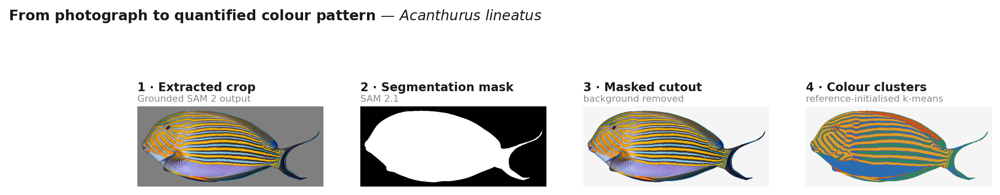
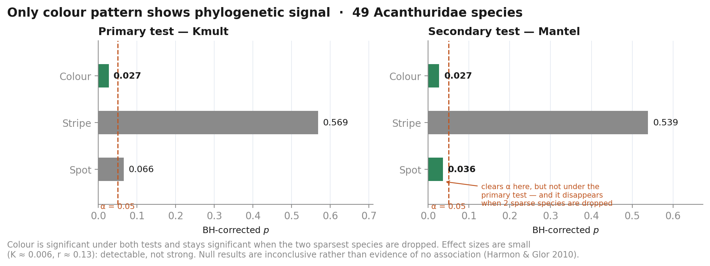

# PhyloVision - Surgeonfish Visual Phenomics and Phylogenetic Inference

Do closely related surgeonfishes look more alike than distant ones? This
pipeline extracts colour, stripe, and spot pattern features from ~1,500
Creative-Commons photographs of 64 Acanthuridae species, reduces them to
per-species feature vectors, and tests each pattern dimension for
phylogenetic signal against a molecular phylogeny.

**Version 6.8.1** — all planned phases (0–5) complete, audited, and re-verified after
the stripe recalibration. See
[CHANGELOG.md](CHANGELOG.md) for the full history, [METHODS.md](METHODS.md) for
the statistical design, and [BACKGROUND.md](BACKGROUND.md) for the
pattern-genetics literature review.

---

## Research question

**Is visual pattern similarity among surgeonfish (family Acanthuridae)
associated with evolutionary relatedness — or does it arise independently of
shared ancestry?**

For 64 Acanthuridae species with a known molecular phylogeny, does quantified
visual similarity between species pairs covary with phylogenetic distance?

**What this design cannot distinguish.** Pattern covarying with phylogeny is
consistent with pattern being heritable, but equally consistent with pattern
tracking an ecological variable (diet, depth, reef zone) that is itself
phylogenetically conserved — closely related surgeonfishes tend to share
ecology, not just genes. Separating those would need ecological covariates and
a phylogenetic-regression approach (`procD.pgls`), which is out of scope here.
This is a correlational test; neither statistic identifies a genetic or
developmental mechanism.

---

## Results




Across **49 species** with real genetic-data phylogenetic placement
([`reports/species_features.csv`](reports/species_features.csv)):

| dimension | Kmult K | Kmult Z | Kmult BH *p* | Mantel *r* | Mantel BH *p* | verdict |
| --- | --- | --- | --- | --- | --- | --- |
| **colour** | 0.0062 | 2.20 | **0.027** ✅ | +0.134 | **0.027** ✅ | **signal detected** |
| spot | 0.0362 | 1.71 | 0.066 | +0.100 | 0.036 | not significant (primary) |
| stripe | 0.0081 | −0.73 | 0.569 | +0.025 | 0.539 | null |

*Primary test: `geomorph::physignal.z` — [`outputs/phase4/kmult_results.csv`](outputs/phase4/kmult_results.csv).
Secondary: label-permutation Mantel — [`outputs/phase4/mantel_results.csv`](outputs/phase4/mantel_results.csv).
Benjamini–Hochberg corrected across the three dimensions.*

**Colour pattern shows weak but robust phylogenetic signal. Stripe and spot do not.**



> **Re-verified after the stripe recalibration.** The stripe detector was recalibrated
> against real SAM 2 masks in v6.2.0 (recall 14.3% → 50.0%), changing the stripe features
> feeding every downstream test, so Phases 2–4 were all re-run. The re-run doubles as a
> control: **colour and spot are untouched by the change, and their Kmult statistics agree
> with the pre-recalibration run to 13 significant figures** (colour K 0.00622579641292539
> → …559), with identical corrected *p*-values. Stripe is the only thing that moved.
> Pre-recalibration results are kept in
> [`outputs/phase4_pre_recalibration/`](outputs/phase4_pre_recalibration/).

**The stripe null is now interpretable, which it previously wasn't.** At ~14% recall a
null couldn't be distinguished from "stripes weren't measured well enough." At 50%
recall, stripe still shows no signal (*r* = +0.025) — that is now a result about the
fish rather than about the instrument.

### Robustness

Re-running everything with the two sparsest species dropped (49 → 47;
[`outputs/phase4_min5/mantel_results.csv`](outputs/phase4_min5/mantel_results.csv)):

| dimension | Kmult 49 → 47 | Mantel 49 → 47 | verdict stable? |
| --- | --- | --- | --- |
| colour | 0.027 → **0.018** | 0.027 → **0.045** | ✅ both |
| stripe | 0.569 → 0.545 | 0.539 → 0.550 | ✅ both |
| spot | 0.066 → 0.135 | 0.036 → **0.119** | ✅ primary / ❌ secondary |

**Every primary-test verdict is stable.** Colour stays significant and strengthens. The
one flip is spot's *secondary* result, which loses significance (0.036 → 0.119) when
*Naso tuberosus* (2 images) and *Acanthurus triostegus* (4) are dropped — direct evidence
that it rested on those two species. Because the preregistered plan makes Kmult primary,
spot was already being reported as non-significant, so no headline conclusion depends on
it. Had the significant secondary result been reported instead, this check would have
shown that claim to be an artifact.

Cross-dimension comparison (`compare.physignal.z`) also shifted with the better stripe
measurement: colour still carries significantly more signal than stripe (*p*=0.040, was
0.014), but spot-vs-stripe is no longer significant (*p*=0.088, was 0.033).

Both p-values now trace to
[`outputs/phase4/comparison_results.csv`](outputs/phase4/comparison_results.csv), which
also records that colour and spot are statistically **indistinguishable** from each other
(*p*=0.714). Until v6.8.0 these were the one set of published numbers with no tracked
file behind them — and that gap is precisely why a superseded version of this paragraph
survived here for five versions with nothing able to detect it. A test now asserts every
cross-dimension p-value quoted above appears in that file.

### How to read these numbers

1. **The effects are weak.** K ≈ 0.006 and *r* ≈ 0.13 for colour. The honest
   claim is "detectable but small," not "pattern tracks phylogeny closely."
2. **K is not a fraction of Brownian motion here.** Features pass through
   logit/`log1p` before testing; K is invariant to the linear standardisation
   that follows but **not** to those nonlinear transforms. Read K
   comparatively — across dimensions and species sets — not against K=1.
3. **Stripe's null is now interpretable.** The detector was recalibrated in
   v6.2.0 and reaches 50% recall (from ~14%), so a null is no longer confounded
   with "not measured well enough." It is still a *low-powered* null — half of
   real stripe patterns are missed, and precision is 40% — but it is a statement
   about the fish, not only about the instrument.
4. **Null results are inconclusive, not evidence of no association** (Harmon &
   Glor 2010).

---

## Pipeline

```
data/raw_images/            64 species · 1,460 CC-licensed photos (GBIF)
        │
        │  Phase 1 · src/fish_extractor/          [GPU · Colab]
        │  Grounding DINO detection → SAM 2.1 segmentation → QA gate
        │  856 accepted · 604 excluded · 0 left flagged
        ▼
data/extracted_fish/        mask-cutout crops, native resolution
        │
        │  Phase 2 · src/pattern_extractor/
        │  ┌─────────────┬─────────────┬─────────────┐
        │  │   colour    │   stripe    │    spot     │   3 independent
        │  │  k-means    │  elongation │    blob     │   extractors
        │  │ hue/sat spc │  + FFT      │   shape     │
        │  └─────────────┴─────────────┴─────────────┘
        │  validated against 155 hand labels - see the honest table below
        ▼
reports/pattern_features.csv        853 rows, one per image
        │
        │  Phase 3 · src/distance_matrices/
        │  aggregate per species → rank-standardise → Euclidean
        ▼
reports/species_features.csv        49 species × 10 features
outputs/*_distance_matrix.csv       3 pattern + 1 patristic (49×49)
        │
        │  Phase 4 · src/phylo_comparison/ + src/r/phase4_kmult.R   [R · geomorph]
        │  Kmult (primary) + Mantel (secondary) + BH correction
        ▼
outputs/phase4/kmult_results.csv · mantel_results.csv · comparison_results.csv
```

Each phase was verified against its own real output before the next began —
see [CHANGELOG.md](CHANGELOG.md). Several phases had to be corrected that way:
Phase 2's first run flagged 99% of images as striped regardless of species, and
Phase 3's first run placed a striped species closer to solid-coloured ones than
to another striped one. Both were real bugs, found by checking output against
something known rather than by trusting the aggregate.

**Reconciling the counts**, since several look inconsistent at a glance — all
of these are checkable against the tracked files:

| quantity | value | source |
| --- | --- | --- |
| source images | 1,460 | `data/raw_images/` |
| log rows | 1,770 | append-only *event* trail — images were re-processed across review rounds |
| exclusion decisions | 605 | three non-overlapping review rounds (521 + 80 + 4), `reports/fish_extraction_review_feedback_round{1,2,3}.json` |
| later restored | −1 | `Acanthurus_achilles/021`, re-accepted as `human_confirmed` |
| **excluded** | **604** | 605 − 1 |
| **accepted** | **856** | 1,460 − 604 ✓ matches the log's accepted tally exactly |
| pattern rows | **853** | 856 − 3 images removed at validation as invalid inputs regardless of pattern (a fin-only crop, a blown-out photo, a dried museum specimen) |

---

## How good are the pattern detectors?

Measured against 155 hand-labelled images on real SAM 2 masks
([`reports/pattern_validation_report.csv`](reports/pattern_validation_report.csv)):

| feature | agreement | precision | recall | F1 | true positives |
| --- | --- | --- | --- | --- | --- |
| `is_solid` | 70.3% | 71.2% | 84.9% | 0.775 | 79 |
| `stripe_present` | 77.4% | 40.0% | 50.0% | 0.444 | 14 |
| `spot_present` | 80.0% | **10.5%** | **12.5%** | **0.114** | **2** |

**Read the F1 column, not the agreement column.** Agreement is inflated by class
imbalance — most images are not spotted, so a detector that almost never fires still
scores ~80%. `spot_present` has the *highest* agreement of the three and is by far the
worst detector: 2 true positives against 17 false positives across 155 images. Earlier
versions of this README quoted its 80% as a validated success; that was misleading, and
this table replaces it.

**What this does and doesn't invalidate.** `spot_present` feeds exactly one of the ten
per-species features (`prop_spotted`). The spot *dimension*'s signal comes from the
continuous features (`mean_spot_count`, `mean_spot_area_fraction`), which are unaffected
by the boolean's threshold — and independently corroborated: dropping the thresholded
proportions entirely *strengthens* spot's Mantel result rather than weakening it
(BH *p* 0.030 → 0.017). So the boolean is unreliable, not the dimension. Treat
`spot_present` as unusable on its own.

---

## Running it

GPU-dependent stages run on **Google Colab**; everything else runs locally on
CPU. All pipeline code is plain importable Python, so the same functions work
from a script or a notebook cell.

```bash
git clone https://github.com/guptrishi01/Surgeonfish_Segmentation_Phylogenetics.git
cd Surgeonfish_Segmentation_Phylogenetics
pip install -e .            # base: requests, Pillow, numpy, scipy, biopython
pip install -e ".[vision]"  # adds torch/transformers/sam2 - only for Phase 1
pytest                      # 206 tests, no GPU needed
```

| phase | notebook | runtime | notes |
| --- | --- | --- | --- |
| 0 · collect images | `python -m dataset_builder.cli` | CPU, local | rate-limited GBIF sourcing |
| 1 · extract fish | [`Phase1_Fish_Extraction.ipynb`](notebooks/Phase1_Fish_Extraction.ipynb) | **GPU** (L4) | needs `[vision]` extra |
| 2 · extract patterns | [`Phase2_Pattern_Extraction.ipynb`](notebooks/Phase2_Pattern_Extraction.ipynb) | CPU | pure NumPy/SciPy/Pillow |
| 3 · distance matrices | [`Phase3_Distance_Matrices.ipynb`](notebooks/Phase3_Distance_Matrices.ipynb) | CPU | fast, deterministic |
| 4 · phylogenetic tests | [`Phase4_Phylogenetic_Comparison.ipynb`](notebooks/Phase4_Phylogenetic_Comparison.ipynb) | CPU + **R** | `rpy2` + `geomorph` |

The Colab notebooks clone the project **onto Google Drive** rather than
ephemeral local disk — that's what keeps resumable per-image state, extracted
images, and review pages valid across a disconnect or restart.

Phase 4 installs `geomorph` from source on first run (5–15 min) and executes
`src/r/phase4_kmult.R` via `rpy2`'s `%%R` magic, so one Python-kernel session
handles both halves without a runtime switch.

---

## Species and phylogeny

64 species across all six extant Acanthuridae genera: *Acanthurus* (31),
*Naso* (14), *Ctenochaetus* (9), *Zebrasoma* (6), *Prionurus* (3),
*Paracanthurus* (1).

**Taxon sampling is uneven.** Against each genus's valid-binomial species count
in NCBI Taxonomy (hybrids and `sp.`/`aff.`/`cf.`/BOLD placeholders excluded —
see `data/genus_species_counts.json`): *Prionurus* 43%, *Naso* 70%,
*Acanthurus* 79%, *Zebrasoma* 86%, *Ctenochaetus* 100%, *Paracanthurus* 100%,
against a family mean of **64/83 (77%)**. Missing species were dropped for
image availability in Phase 0, not by design. *Prionurus* is the only genus
clearly below the family mean; *Naso* is second-lowest, which matters because
sparse sampling in one of Acanthuridae's two deep clades disproportionately
shapes the large phylogenetic distances that most influence these tests.

**Phylogeny.** The Fish Tree of Life's **genetic-data-only** tree (Rabosky et
al. 2018) — not its "complete" tree, which places species lacking genetic data
by stochastic polytomy resolution, something its own documentation says
shouldn't be used for trait-evolution analysis. **50 of 64 species (78.1%)**
have real genetic placement; the analysis set is 49 after *Naso maculatus*
drops out (its only image is its curated reference photo). Full audit trail in
[`data/phylogeny/`](data/phylogeny/).

**A testable prediction.** *Acanthurus* is paraphyletic with respect to
*Ctenochaetus*; Sorenson et al. (2013) recover this specifically as
*Ctenochaetus* nested with *A. nubilus* and *A. pyroferus*. Both named species
are present in the matched set, so whether that paraphyly also appears in
visual similarity is checkable as named. Caveat: restricting to genetically
sampled species drops *Acanthurus* coverage to **54%**, the lowest of any
genus post-restriction.

---

## Data sourcing and compliance

Images are collected programmatically via `src/dataset_builder/` — not
hand-collected, not scraped from web search results.

- **Source: [GBIF](https://www.gbif.org)'s REST API**, which aggregates
  research-grade CC-licensed photos from iNaturalist and others. iNaturalist's
  own API host disallows generic automated query-string access; going through
  GBIF respects that boundary rather than routing around it.
- **robots.txt is enforced at runtime** before every request — including each
  image download, which can land on a different host than the API.
- **License allowlist:** CC0/public-domain and CC-BY/BY-SA/BY-NC/BY-NC-SA only.
  No-derivatives licenses are excluded, since this pipeline produces derivative
  works. License and attribution are logged per image to
  [`reports/image_sourcing_log.csv`](reports/image_sourcing_log.csv).
- **Rate-limited and self-identifying:** 1 request/second, descriptive
  `User-Agent` with contact address, backoff on transient errors.
- **Human visual review**, not more heuristic tuning — automated filters catch
  mechanical problems but can't judge "is this a clean, close-up, single-fish
  photo."
- **Open action:** GBIF recommends registering a derived-dataset DOI for
  search-API pulls. Required before publication; not yet done.

---

## Repository structure

```
├── src/
│   ├── dataset_builder/       Phase 0 · GBIF sourcing, license/robots compliance
│   ├── fish_extractor/        Phase 1 · Grounded SAM 2 detection + segmentation
│   ├── pattern_extractor/     Phase 2 · colour/stripe/spot feature extraction
│   ├── distance_matrices/     Phase 3 · per-species aggregation + distances
│   ├── phylo_comparison/      Phase 4 · Kmult feature prep + tree export
│   ├── r/phase4_kmult.R       Phase 4 · physignal.z, compare.physignal.z, Mantel
│   └── scripts/               figure generation + check-input builders
├── notebooks/                 Colab notebooks, one per phase
├── tests/                     206 tests, GPU calls mocked
├── data/
│   ├── raw_images/            64 species · zipped source photos
│   ├── phylogeny/             reference tree, coverage table, synonyms
│   ├── genes/                 candidate genes from the literature review
│   └── genome_assemblies/     NCBI availability survey (metadata only)
├── reports/                   per-image features, audit logs, hand labels
├── outputs/
│   ├── *_distance_matrix.csv  49×49 pattern + patristic distances (primary set)
│   ├── phase4/                Kmult + Mantel results, primary 49-species run
│   ├── phase4_min5/           …the 47-species sparse-species sensitivity run
│   ├── phase4_noprops/        …with the redundant thresholded proportions dropped
│   ├── phase4_pre_recalibration/  Kmult results from before the v6.2.0 stripe fix
│   ├── sensitivity_min5/      Phase 3 distance matrices for the 47-species set
│   ├── sensitivity_with_reference/  …for the 50-species set (reference photos kept)
│   ├── patternize_check/      inputs + result for the R-package equivalence check
│   └── gbif_derived_dataset.csv   source-dataset attribution table
├── figures/                   generated figures (src/scripts/make_figures.py)
├── METHODS.md                 statistical design and preregistration
├── CHANGELOG.md               full version history
└── BACKGROUND.md              pattern-genetics literature review
```

Result tables under `reports/` and `outputs/` are tracked deliberately — every
number above traces to one, so a clone can check them without re-running a GPU
pipeline.

---

## Limitations

- **Weak effect sizes.** Detectable, not strong. See "How to read these numbers."
- **Features within a dimension are partly redundant.** Each dimension carries
  both a continuous measure and a proportion thresholded from that same
  measure, so they correlate strongly by construction: `mean_hue_dispersion` ~
  `prop_solid` (*r*=−0.95), `mean_elongated_region_count` ~ `prop_striped`
  (*r*=+0.92), `mean_spot_count` ~ `prop_spotted` (*r*=+0.80). The matrices stay
  well-conditioned (condition numbers 7.5 / 5.4 / 3.2) so the tests are valid,
  but "4 colour features" overstates the independent information — the
  effective dimensionality is lower than the feature count suggests.
- **`spot_present` is effectively non-functional** (F1 0.114, 2 true positives in
  155 images). Use the continuous spot features instead; see the detector table.
- **`stripe_present` reaches 50% recall at 40% precision** after the v6.2.0
  recalibration. Better than the ~14% it replaced, but still noisy in both
  directions — roughly half its positives are wrong and half of real stripes are
  missed.
- **Correlation, not mechanism.** These tests cannot separate inherited pattern
  from phylogenetically conserved ecology.
- **n=49.** Small for comparative methods; power is limited and null results
  should be read accordingly.
- **Uneven taxon sampling**, especially *Prionurus* (43%) and *Naso* (70%),
  and *Acanthurus* at 54% after the phylogeny restriction.
- **The synonym table is NCBI-derived**, not a fish taxonomic authority. It
  gates the one match (*Zebrasoma veliferum*) that makes coverage 50 rather
  than 49.

---

## Open follow-ups

Distinct from the limitations above: those bound what the result means, these
are actionable and unfinished.

| # | item | why it matters |
| --- | --- | --- |
| 1 | **GBIF derived-dataset DOI — table built, registration deliberately not done** | All 1,878 occurrences resolved to 5 source datasets ([`outputs/gbif_derived_dataset.csv`](outputs/gbif_derived_dataset.csv)). GBIF's data user agreement asks for a DOI citation when data is *used in research or policy*; this project is exploratory work that isn't being published, so the trigger doesn't apply. The table is ready if that changes — register at [gbif.org/derived-dataset/register](https://www.gbif.org/derived-dataset/register). |
| 2 | ~~Improve `stripe_present` recall~~ — **done** | Recalibrated against real SAM 2 masks: recall **14.3% → 50.0%** at identical precision, validated held-out over 200 split-half trials. Stripe's null is now interpretable rather than confounded with poor measurement. |
| 3 | ~~Validate the *patternize* port~~ — **done** | Worst disagreement **0.0037** across 12 cluster fractions on 3 species, against a 0.05 threshold set before running. The port is validated. |
| 4 | ~~Cross-check the synonym table against a fish taxonomic authority~~ — **done** | FishBase confirms *Zebrasoma velifer* (Bloch, 1795), Acanthuridae. The project labels it *veliferum*, a nomenclatural convention difference, not an identity error. |
| 5 | ~~Test dropping the redundant thresholded proportions~~ — **done, both tests** | Every verdict is stable under Kmult *and* Mantel ([`outputs/phase4_noprops/`](outputs/phase4_noprops/)). Colour in fact **strengthens** without them (BH *p* 0.027 → 0.009): the redundancy was mildly diluting the signal, not creating it. |
| 6 | ~~Export `compare.physignal.z` to a tracked file~~ — **done** | [`outputs/phase4/comparison_results.csv`](outputs/phase4/comparison_results.csv) now carries the effect sizes and the full pairwise Z / P matrices, so every published number traces to a file. The test that was skipping now runs. |

**Four of the six are closed by evidence, one is deliberately skipped, and one needs a
single Colab run.** What remains beyond that is new research rather than unfinished
work — see Status below.

### The patternize port is validated

`pattern_extractor`'s colour clustering is a Python reimplementation of *patternize*'s
reference-initialised k-means. For most of this project's life it had never been checked
against the R package, which made it the largest unquantified risk in the pipeline —
it sits directly upstream of the only significant result. That check has now been run.

Running both on identical pixel sets from identical starting centres
([`outputs/patternize_check/equivalence_result.csv`](outputs/patternize_check/equivalence_result.csv)):

| image | `patternize::kImage()` | `pattern_extractor` | max diff |
| --- | --- | --- | --- |
| *A. lineatus* (striped) | 0.3030 0.2787 0.2448 0.1735 | 0.3030 0.2760 0.2454 0.1756 | 0.0027 |
| *C. striatus* (mid) | 0.4884 0.2943 0.2081 0.0092 | 0.4919 0.2947 0.2044 0.0090 | 0.0037 |
| *Z. flavescens* (plain) | 0.4209 0.4189 0.1237 0.0365 | 0.4235 0.4201 0.1234 0.0330 | 0.0034 |

**Worst disagreement: 0.0037**, against a 0.05 threshold stated *before* the run. That is
the scale expected from k-means convergence differences between two independent
implementations, not a porting bug.

**Getting there required fixing the test twice.** A first attempt compared the two on the
same crop and reported differences of 0.11–0.26 — which established nothing, because
`kImage()` clusters the whole raster including the mask cutout's grey background while
`pattern_extractor` clusters masked-in pixels only. The two were partitioning different
pixel sets. Re-running on images containing *only* masked-in pixels dropped the worst
disagreement from **0.2638 to 0.0037** — a ~70× change produced entirely by fixing the
comparison, not the code under test. The alarming first number was an artifact of the
measurement, which is worth recording given how easily it could have been read as a
finding.

---

## Status

Rebuilt from scratch after an earlier pipeline produced unreliable results — a
broken evaluation metric, a misreported ROC-AUC, a silently dropped test image,
and a phylogenetic-signal result that came from data-dredged feature selection
rather than a preregistered test. Every statistical choice here was pinned in
writing before the tests ran ([METHODS.md](METHODS.md)), and every phase was
verified against real output before the next began.

**Phase 5 (the documentation rewrite) was the last planned phase.** Work since then has
been verification rather than new pipeline: a full data-integrity audit (now a permanent
test module), the stripe recalibration against real masks, validating the *patternize*
port against the R package, and closing the remaining follow-ups. The pipeline itself has
not changed since the stripe fix.

**What would count as new work**, if this were picked up again: ecological covariates and
`procD.pgls` to separate inherited pattern from phylogenetically conserved ecology — the
distinction this design explicitly cannot make; more hand labels to make the spot
dimension testable (16 positives is too few to calibrate against); or more species and
images to lift n=49, which currently limits power enough that null results are
inconclusive by construction.

### Phase 6 was scoped and deliberately not pursued

Phase 6 — checking whether the 56 candidate genes from
[BACKGROUND.md](BACKGROUND.md) appear in available genome assemblies — was
always contingent on Phase 4 finding significance. It technically did, for
colour. The phase was then scoped properly, and the evidence does not support
running it:

| constraint | value |
| --- | --- |
| species with a public genome assembly | 16 of 64 |
| …**also** in the 49-species analysis set | **14** |
| …at chromosome level (rest are scaffold) | **1** |
| Acanthuridae skin transcriptomes in the literature | **0** |

At n=14, a genotype–phenotype correlation would need **|r| ≥ 0.78** to survive
correction across the 52 colour candidate genes. Power to detect a true
*r*=0.5 — already strong for a polygenic trait — is **6.9%**. For scale, the
phenotype signal this would be chasing is *r*=0.13.

So a null result would be uninterpretable (no power to distinguish "no
association" from "couldn't have seen one"), while a positive result at n=14
across 52 genes would more likely be noise — which is precisely the
data-dredging failure mode this project was rebuilt to escape. The
presence/absence half is feasible but near-vacuous: teleost pigmentation genes
are deeply conserved, so finding them in a surgeonfish genome is close to
guaranteed and says nothing about pattern variation. The expression half has no
data to run on at all.

**The higher-value next step is measurement, not genomics:** fixing
`stripe_present`'s ~14% recall. Stripe is currently the one dimension where the
biological question is unanswerable for a fixable reason — the detector, not
nature.

---

## Acknowledgements

Conducted in the **Dornburg Lab** at the University of North Carolina
Charlotte. Phylogenetic reference data from the
[Fish Tree of Life](https://fishtreeoflife.org). Image data from
[GBIF](https://www.gbif.org) contributors under Creative Commons licenses.
GPU computation on Google Colab. The Phase 2 colour-clustering methodology is
a Python reimplementation of *patternize* (Van Belleghem et al. 2018); the
Phase 4 statistics run in *geomorph* (Adams, Collyer et al.). Full citations
in [METHODS.md](METHODS.md).
